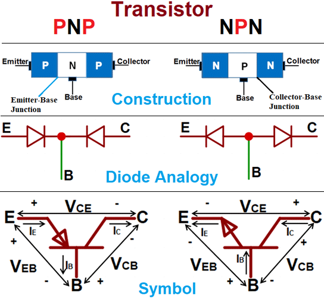
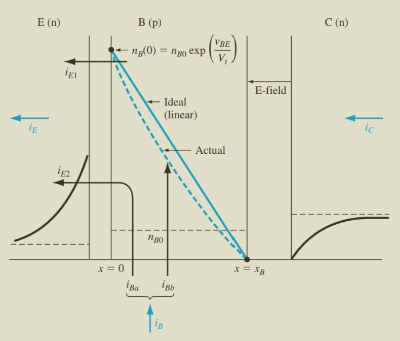
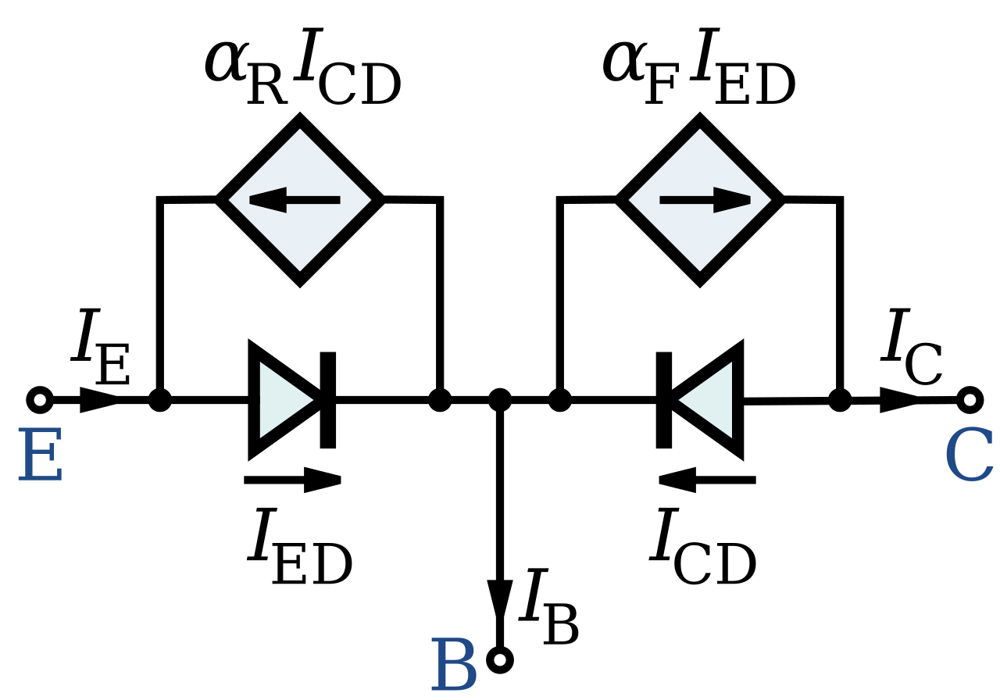

Bipolar Junction Transistors (**BJTs**) are **three-layer, two-junction** semiconductor devices — either **NPN** or **PNP** — that can **amplify** or **switch** electrical signals.  
They build directly on the physics of **PN junctions**, using **two back-to-back junctions** to control current flow.

**Regions of a BJT:**

- **Emitter (E):** Heavily doped to inject carriers efficiently.
- **Base (B):** Very thin and lightly doped to allow carriers to pass through with minimal recombination.
- **Collector (C):** Moderately doped and larger in area to collect carriers and dissipate heat.

 

---

## **3.2 Modes of Operation**

The operation of a BJT depends on the biasing of its two PN junctions: the **Emitter-Base (E-B)** junction and the **Collector-Base (C-B)** junction.

| **Mode** | **E-B Junction** | **C-B Junction** | **Characteristics** |
|----------|------------------|------------------|---------------------|
| **Cut-off** | Reverse Biased | Reverse Biased | $I_C \approx 0$, transistor is OFF |
| **Active (Forward)** | Forward Biased | Reverse Biased | $I_C = \beta I_B$, used for amplification |
| **Saturation** | Forward Biased | Forward Biased | $I_C$ limited by circuit, transistor acts as closed switch |
| **Reverse Active** | Reverse Biased | Forward Biased | $I_E = \beta_R I_B$, reverse gain $\beta_R \ll \beta$ |

**Detailed Operating Conditions:**

1. **Cut-off Mode:**  
   - Both junctions are reverse-biased: $V_{BE} < V_{BE(on)}$ (typically < 0.7 V for Si) and $V_{BC} < 0$
   - **Voltage condition:** The base voltage ($V_{base}$) is lower than both the collector voltage ($V_{collector}$) and emitter voltage ($V_{emitter}$)
   - Collector current: $I_C \approx I_{CBO}$ (leakage current, typically nA range)
   - Transistor acts as an **open switch**

2. **Active Mode (Normal Operation):**  
   - E-B junction forward-biased: $V_{BE} \approx 0.7$ V (Si), $V_{BE} \approx 0.3$ V (Ge)
   - C-B junction reverse-biased: $V_{CB} > 0$ or equivalently $V_{CE} > V_{CE(sat)}$
   - **Voltage condition:** The base voltage ($V_{base}$) is higher than the emitter voltage ($V_{emitter}$) but lower than the collector voltage ($V_{collector}$)
   - Collector current: $I_C = \beta I_B$ where $\beta$ typically ranges from 50 to 300
   - This mode is used for **linear amplification**

3. **Saturation Mode:**  
   - Both junctions forward-biased: $V_{BE} > V_{BE(on)}$ and $V_{BC} > 0$
   - **Voltage condition:** The base voltage ($V_{base}$) is higher than both the emitter voltage ($V_{emitter}$) and collector voltage ($V_{collector}$)
   - Collector-emitter voltage: $V_{CE(sat)} \approx 0.2$ V (Si)
   - Current relationship $I_C = \beta I_B$ no longer holds; $I_C < \beta I_B$
   - Transistor acts as a **closed switch** in digital circuits

4. **Reverse Active Mode:**  
   - E-B junction reverse-biased and C-B junction forward-biased
   - Rarely used; has poor characteristics with $\beta_R \approx 0.1$ to $5$ (much less than $\beta$)
   - Emitter current: $I_E = \beta_R I_B$

---

## **3.3 Carrier Transport in Active Mode**

In **active mode**, the forward bias on the **E-B** junction injects **majority carriers** from the **emitter** into the **base**.  
These carriers diffuse across the **thin base** and are swept into the **collector** by the reverse-biased **C-B junction’s electric field**.

**Transport Mechanisms:**

1. **Injection:** High emitter doping → large carrier injection into the base.
2. **Diffusion:** Carriers move through the base via **diffusion** due to a concentration gradient.
3. **Collection:** Carriers reaching the **base-collector** junction are quickly swept into the **collector**.

>

 

---

## **3.4 Current Relationships**

The fundamental relationship between the three terminal currents in a BJT is governed by **Kirchhoff's Current Law**:

$$
I_E = I_C + I_B
$$

where:
- $I_E$ = Emitter current (largest)
- $I_C$ = Collector current  
- $I_B$ = Base current (smallest, typically 1-2% of $I_E$)

### **3.4.1 Common-Base Current Gain ($\alpha$)**

The **common-base current gain** $\alpha$ (also called the **base transport factor**) is defined as:

$$
\alpha = \frac{I_C}{I_E}
$$

For well-designed BJTs, $0.95 \leq \alpha \leq 0.999$, typically $\alpha \approx 0.98$ to $0.99$.

The parameter $\alpha$ can be further decomposed as:

$$
\alpha = \gamma \cdot \alpha_T \cdot (1 - \delta)
$$

where:
- $\gamma$ = **Emitter injection efficiency** (fraction of emitter current due to majority carriers)
- $\alpha_T$ = **Base transport factor** (fraction of injected carriers reaching collector)
- $(1 - \delta)$ = **Recombination factor** accounting for carrier loss in base

### **3.4.2 Common-Emitter Current Gain ($\beta$)**

The **common-emitter current gain** $\beta$ (also called $h_{FE}$ in hybrid parameters) is:

$$
\beta = \frac{I_C}{I_B}
$$

The relationship between $\alpha$ and $\beta$ is derived from $I_E = I_C + I_B$:

$$
\alpha = \frac{I_C}{I_E} = \frac{I_C}{I_C + I_B} = \frac{1}{1 + \frac{1}{\beta}}
$$

Solving for $\beta$:

$$
\beta = \frac{\alpha}{1 - \alpha}
$$

Conversely:

$$
\alpha = \frac{\beta}{\beta + 1}
$$

**Typical values:** $\beta$ ranges from 50 to 300 (sometimes up to 500 for high-gain transistors).

### **3.4.3 Active Mode Current Equations**

In **active mode**, the collector current can be expressed as:

$$
I_C = \beta I_B = \alpha I_E
$$

The emitter current:

$$
I_E = \left(1 + \frac{1}{\beta}\right) I_C = (\beta + 1) I_B
$$

**Example:** If $\alpha = 0.98$, then:

$$
\beta = \frac{0.98}{1 - 0.98} = \frac{0.98}{0.02} = 49
$$

If $I_B = 20 \, \mu\text{A}$, then:
- $I_C = \beta I_B = 49 \times 20 \, \mu\text{A} = 0.98 \, \text{mA}$
- $I_E = I_C + I_B = 0.98 + 0.02 = 1.0 \, \text{mA}$

---

## **3.5 Ebers–Moll Model**

The **Ebers–Moll model** describes a BJT in **all regions** of operation, using two coupled diodes.

**Collector Current Equation:**

$$
I_C = I_S \left( e^{V_{BE}/V_T} - 1 \right) - \alpha_R I_S \left( e^{V_{BC}/V_T} - 1 \right)
$$

**Emitter Current Equation:**

$$
I_E = \alpha_F I_S \left( e^{V_{BE}/V_T} - 1 \right) - I_S \left( e^{V_{BC}/V_T} - 1 \right)
$$

Where:

- $I_S$ = Saturation current of the transistor  
- $V_T$ = Thermal voltage (~25.85 mV at room temperature)  
- $\alpha_F$ = Forward common-base gain  
- $\alpha_R$ = Reverse common-base gain

 

---

## **3.6 Configurations of BJT**

A BJT can be connected in three basic configurations, each with different characteristics and applications. The choice of configuration depends on the desired gain characteristics, impedance levels, and application requirements.

### **3.6.1 Common-Emitter (CE) Configuration**

In the **Common-Emitter configuration**, the input is applied between base-emitter and the output is taken between collector-emitter; the **emitter is the common (grounded) terminal**. This is the **most widely used amplifier configuration** because it provides both high current gain and high power gain.

**Circuit Characteristics:**
- **Input:** Base-Emitter ($V_{BE}$, $I_B$)
- **Output:** Collector-Emitter ($V_{CE}$, $I_C$)
- **Common terminal:** Emitter (grounded)

**Current Relationships:**

The emitter current relation is:

$$
I_E = I_C + I_B
$$

The **current gain** in CE configuration is:

$$
\beta = \frac{I_C}{I_B}
$$

where $\beta$ typically ranges from 20 to 200 for general-purpose BJTs.

Another important current ratio is:

$$
\alpha = \frac{I_C}{I_E}
$$

with $\alpha < 1$, usually around 0.95-0.99.

The relationship between $\alpha$ and $\beta$ is:

$$
\beta = \frac{\alpha}{1 - \alpha}, \quad \alpha = \frac{\beta}{\beta + 1}
$$

**Operating Principle:**

A small change in base current $I_B$ causes a much larger change in collector current $I_C$ → this is the key amplification mechanism.

**Key Parameters:**
- **Current gain:** $A_i = \beta$ (high, typically 50-300)
- **Voltage gain:** $A_v = -\frac{\beta R_C}{r_e}$ (high, typically 100-500)
- **Input impedance:** $Z_{in} = \beta r_e$ (low to moderate, ~1-5 kΩ)
- **Output impedance:** $Z_{out} \approx R_C$ (moderate, ~1-10 kΩ)
- **Phase shift:** 180° (inverting amplifier - input and output are out of phase)

**Applications:** Voltage amplifiers, power amplifiers, switching circuits

### **3.6.2 Common-Base (CB) Configuration**

In the **Common-Base configuration**, the **base terminal is common to both input and output**; the input is applied between emitter and base, and output is taken between collector and base.

**Circuit Characteristics:**
- **Input:** Emitter-Base ($V_{EB}$, $I_E$)
- **Output:** Collector-Base ($V_{CB}$, $I_C$)
- **Common terminal:** Base (grounded)

**Current Relationships:**

The input current at the emitter is large, since:

$$
I_E = I_B + I_C
$$

Therefore, the collector current is slightly less than emitter current, giving:

$$
\alpha = \frac{I_C}{I_E} < 1
$$

This means the **current gain is less than unity** (unity or less).

**Operating Principle:**

Because the current gain is less than one, the CB amplifier **attenuates current**, not amplifies it. However, it is a **non-inverting voltage amplifier** → input and output voltages are in phase.

It has **high voltage gain** due to:
- **Low input resistance** (forward-biased emitter-base diode)
- **High output resistance** (reverse-biased collector-base junction)

**Voltage Gain:**

The Common-Base voltage gain is:

$$
A_v = \frac{\alpha R_L}{r_e}
$$

where $R_L$ is the load resistance and $r_e$ is the emitter resistance.

**Resistance Gain:**

The CB configuration exhibits significant resistance gain:

$$
A_R = \frac{R_L}{R_{in}}
$$

where $R_{in}$ is very low and $R_L$ is typically much larger.

**Key Parameters:**
- **Current gain:** $A_i = \alpha \approx 0.98$ (less than unity but close to 1)
- **Voltage gain:** $A_v = \frac{\alpha R_C}{r_e}$ (high, similar to CE)
- **Input resistance:** $R_{in} = r_e$ (very low, ~20-50 Ω)
- **Output resistance:** $R_{out}$ (very high, ~100 kΩ - 1 MΩ)
- **Phase shift:** 0° (non-inverting - input and output are in phase)

**Applications:** Not commonly used in general amplifiers, but useful in high-frequency applications due to low input capacitance and stable behavior; RF circuits, current buffers

### **3.6.3 Common-Collector (CC) Configuration (Emitter Follower)**

In the **Common-Collector configuration**, the **collector terminal is common to both input and output** (usually tied to supply/ground through a resistor). The input signal is applied to the base, and the output is taken from the emitter, making it an **Emitter Follower** (output follows input).

**Circuit Characteristics:**
- **Input:** Base-Collector ($V_{BC}$, $I_B$)
- **Output:** Emitter-Collector ($V_{EC}$, $I_E$)
- **Common terminal:** Collector (usually connected to $V_{CC}$)

**Current Relationships:**

The load resistor is connected in series with the emitter, so the load current equals the emitter current.

Since:

$$
I_E = I_C + I_B
$$

the emitter current is larger than collector current, which leads to a **high current gain**.

**Current Gain:**

The current gain of the CC configuration is approximately:

$$
A_i \approx 1 + \beta
$$

which is much larger than $\beta$ of a CE amplifier.

**Operating Principle:**

It provides **very high input impedance** (hundreds of kΩ) and **low output impedance**, making it excellent for **impedance matching**.

The **voltage gain is slightly less than 1**, but the circuit provides **no phase inversion**, unlike CE configuration.

**Key Parameters:**
- **Current gain:** $A_i = \beta + 1$ (high)
- **Voltage gain:** $A_v = \frac{\beta R_E}{r_e + (\beta + 1)R_E} \approx 1$ (unity, ~0.95-0.99)
- **Input impedance:** $Z_{in} = (\beta + 1)R_E$ (very high, ~10-500 kΩ)
- **Output impedance:** $Z_{out} = \frac{R_S}{\beta + 1} || R_E$ (very low, ~10-100 Ω)
- **Phase shift:** 0° (non-inverting, output follows input)

**Applications:** Impedance matching circuits, buffer stages, voltage regulators, driver stages

**Comparison Table:**

| **Parameter** | **Common-Emitter** | **Common-Base** | **Common-Collector** |
|---------------|--------------------|-----------------|--------------------|
| Current Gain | High ($\beta$) | Low ($\alpha < 1$) | High ($\beta + 1$) |
| Voltage Gain | High (~100-500) | High (~100-500) | Unity (~1) |
| Power Gain | Very High | High | Medium |
| Input Impedance | Medium | Very Low | Very High |
| Output Impedance | Medium | Very High | Very Low |
| Phase Shift | 180° | 0° | 0° |

---

## **3.7 Output Characteristics**

In the **common-emitter configuration**, the $I_C$ vs. $V_{CE}$ characteristics exhibit distinct operating regions:

**Characteristic Regions:**

1. **Cut-off Region:** $I_B = 0$, $I_C \approx I_{CEO}$ (leakage)
2. **Active Region:** $I_C = \beta I_B$ (nearly flat curves)
3. **Saturation Region:** $V_{CE} < V_{CE(sat)} \approx 0.2$ V, transistor fully ON

In the **active region**, the curves are **nearly horizontal**, indicating that:
- $I_C$ is primarily controlled by $I_B$ 
- $I_C$ shows slight dependence on $V_{CE}$

The small positive slope in the active region is due to the **Early Effect** (also called **base-width modulation**).

### **3.7.1 Early Effect (Base-Width Modulation)**

**Definition:** The **Early Effect** is the variation of the effective base width with changes in the collector-base reverse bias voltage. As $V_{CB}$ increases, the depletion region at the collector-base junction widens, effectively reducing the neutral base width $W_B$.

**Physical Mechanism:**
- Increasing $V_{CE}$ (or $V_{CB}$) increases the reverse bias on the C-B junction
- This widens the C-B depletion region, encroaching into the base
- The effective base width decreases: $W_B \rightarrow W_B - \Delta W$
- Carrier gradient in base increases: $\frac{dn}{dx}$ increases
- Collector current increases slightly

**Mathematical Description:**

The collector current including the Early Effect is:

$$
I_C = I_S e^{V_{BE}/V_T} \left(1 + \frac{V_{CE}}{V_A}\right)
$$

where:
- $V_A$ = **Early voltage** (typically 50-200 V)
- $I_S$ = Saturation current
- $V_T$ = Thermal voltage ($\approx 26$ mV at 300 K)

The **output resistance** in active mode is:

$$
r_o = \frac{\partial V_{CE}}{\partial I_C}\bigg|_{I_B=\text{const}} = \frac{V_A + V_{CE}}{I_C} \approx \frac{V_A}{I_C}
$$

**Practical Implications:**
- Limits the maximum voltage gain of amplifiers
- Introduces finite output impedance ($r_o$)
- Causes slight variation in $\beta$ with $V_{CE}$
- More pronounced in transistors with narrow base widths

**Graphical Interpretation:** When the $I_C$-$V_{CE}$ curves in the active region are extrapolated backward, they meet at a common point on the negative $V_{CE}$ axis at voltage $-V_A$ (the Early voltage).

 

---

## **3.8 Summary of Key Equations**

### **Current Relationships:**

**Kirchhoff's Current Law:**
$$
I_E = I_C + I_B
$$

**Common-Base Current Gain:**
$$
\alpha = \frac{I_C}{I_E}, \quad 0.95 \leq \alpha \leq 0.999
$$

**Common-Emitter Current Gain:**
$$
\beta = \frac{I_C}{I_B} = \frac{\alpha}{1 - \alpha}, \quad \text{typically } 50 \leq \beta \leq 300
$$

**Active-Mode Relationships:**
$$
I_C = \beta I_B = \alpha I_E
$$

$$
I_E = (\beta + 1) I_B = \frac{I_C}{\alpha}
$$

### **Ebers-Moll Model:**

**Collector Current:**
$$
I_C = I_S \left( e^{V_{BE}/V_T} - 1 \right) - \alpha_R I_S \left( e^{V_{BC}/V_T} - 1 \right)
$$

**Emitter Current:**
$$
I_E = \alpha_F I_S \left( e^{V_{BE}/V_T} - 1 \right) - I_S \left( e^{V_{BC}/V_T} - 1 \right)
$$

### **Active-Mode Approximations:**

For $V_{BE} \gg V_T$ and $V_{BC} < 0$ (reverse-biased C-B junction):

$$
I_C \approx I_S e^{V_{BE}/V_T}
$$

$$
I_E \approx \alpha_F I_S e^{V_{BE}/V_T}
$$

### **Including Early Effect:**

$$
I_C = I_S e^{V_{BE}/V_T} \left(1 + \frac{V_{CE}}{V_A}\right)
$$

where $V_A$ is the Early voltage.

**Output Resistance:**
$$
r_o = \frac{V_A + V_{CE}}{I_C} \approx \frac{V_A}{I_C}
$$

### **Small-Signal Parameters:**

**Transconductance:**
$$
g_m = \frac{\partial I_C}{\partial V_{BE}}\bigg|_{V_{CE}=\text{const}} = \frac{I_C}{V_T} \approx \frac{I_C}{26 \text{ mV}}
$$

**Input Resistance (Emitter Resistance):**
$$
r_e = \frac{V_T}{I_E} \approx \frac{26 \text{ mV}}{I_E}
$$

**Base-Emitter Input Resistance:**
$$
r_{\pi} = \frac{\partial V_{BE}}{\partial I_B}\bigg|_{V_{CE}=\text{const}} = \frac{\beta}{g_m} = \beta r_e
$$

These equations are essential for designing **amplifiers** and **switching circuits** using BJTs.

---

## **References**

For detailed derivations and additional information, refer to:

1. S. M. Sze & K. Ng, *Physics of Semiconductor Devices*, Chapter 5: Bipolar Transistors
2. B. G. Streetman & S. Banerjee, *Solid State Electronic Devices*, Chapter 6: BJTs
3. R. F. Pierret, *Advanced Semiconductor Fundamentals*, Chapters 3-5
4. Donald A. Neamen, *Semiconductor Physics and Devices*, Chapter 10: The Bipolar Transistor

---

